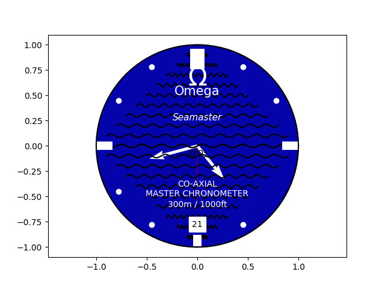

# Python_clock

Clock animation done on Python. Same implementation as my MATLAB clock animation, plus a couple of themed variations built for fun.



## Files

- **`clock_animation.py`** — The base analog clock animation, ported from my original MATLAB implementation. Displays hour, minute, and second hands updating in real time.
- **`lateksii.py`** — A math-themed clock face. Instead of plain numbers, each hour position shows a mathematical expression that evaluates to it (e.g. `√121` for 11, `2×3!` for 12, `d/dt 3x` for 3). Inspired by a clock I saw in my guild room (kiltahuone) at university.
- **`seamaster.py`** — An attempt at recreating the look of an Omega Seamaster watch face — dial text, indices, and hand styling modeled after the real thing.

## Requirements

- Python 3.x
- matplotlib
- numpy

Install with:
```bash
pip install -r requirements.txt
```

## Usage

Clone the repo and run any of the clock scripts directly:

```bash
git clone https://github.com/thienantrieu/Python_clock.git
cd Python_clock
python clock_animation.py
```

Swap in `lateksii.py` or `seamaster.py` to see the other clock faces.

## Background

This started as a Python port of a clock animation I originally built in MATLAB, and grew into a small personal playground for testing different clock face designs with matplotlib's animation tools.

## License

MIT
